# LogManager - Task-Aware Logging System

A comprehensive logging manager built on top of [Loguru](https://github.com/Delgan/loguru) that provides task-aware logging with shared handlers across tasks. Designed as a single logger instance throughout the application lifecycle, following Loguru's key design principle of global logger management.

## Features

- **Task-Aware Logging**: Different logging behaviors for different application components using the same logger instance
- **Shared Handlers**: All tasks can share the same set of handlers with task-specific filtering
- **YAML Configuration**: Easy-to-manage configuration files for handlers and task mappings
- **Multiple Handlers**: Multiple output handlers (stdout, files, custom destinations) with task-based routing
- **Automatic Cleanup**: Proper resource cleanup on program exit
- **Dynamic Filtering**: Task and level-based log filtering with shared handlers
- **Global Logger**: Single logger instance used throughout the entire application

## Installation

### From Source (Development)

```bash
# Clone the repository
git clone https://github.com/xiaodoushabing/loguru-logmanager.git
cd loguru-logmanager

# Install in editable mode with test dependencies
pip install -e .[test]
```

### As a Library

```bash
# Install directly from the project directory
pip install -e .
```

After installation, you can import LogManager from anywhere:

```python
from logmanager import LogManager
```

## Design Philosophy

LogManager follows Loguru's core principle of maintaining a **single global logger instance** throughout the application lifecycle. Instead of creating multiple logger instances, it uses:

- **One Logger**: The same `logger` instance is used across the entire application
- **Task-Aware Filtering**: Different tasks get different logging behaviors through custom filtering
- **Shared Handlers**: Tasks can share the same set of handlers (stdout, files, custom destinations, etc.), but each task can configure different minimum log levels for each handler
- **Dynamic Configuration**: Tasks can be added, removed, or modified at runtime

## Quick Start

### Step 1: Install the Package

```bash
# Install from your project directory
cd /path/to/loguru-logmanager
pip install -e .
```

### Step 2: Basic Usage (Default Configuration)

```python
from logmanager import LogManager
from loguru import logger

# Initialize LogManager once at application startup
log_manager = LogManager()

# Get a logger for your task
logger_main = log_manager.get_logger("default_task")
logger_main.info("Hello, World!")
```

### Step 3: Using Custom Configuration

```python
from logmanager import LogManager
from loguru import logger

# Initialize with custom config file
log_manager = LogManager(config_path="./path/to/your/config.yaml")

# Get different loggers for different tasks
logger_a = log_manager.get_logger("logger_a")  # Must exist in config
logger_b = log_manager.get_logger("logger_b")  # Must exist in config

logger_a.info("Message from logger A")
logger_b.warning("Warning from logger B")
```

## Configuration

### Default Configuration

LogManager comes with a built-in default configuration that you can use immediately:

```python
from logmanager import LogManager

# Uses default config automatically
lm = LogManager()
logger_default = lm.get_logger("default_task")
logger_default.info("This works out of the box!")
```

### Custom YAML Configuration

For advanced usage, create a YAML configuration file. The LogManager supports YAML configuration files for defining formats, handlers, and logger mappings.

#### Example Configuration File (`my_config.yaml`):

```yaml
# Define custom formats
formats:
  simple: "{time:YYYY-MM-DD HH:mm:ss} | {level: <8} | {extra[logger_name]} | {message}"
  detailed: "{time:YYYY-MM-DD HH:mm:ss.SSS} | {level: <8} | {extra[logger_name]} | {file: <16} | {function}:{line} | {message}"

# Define handlers
handlers:
  console_handler:
    sink: "sys.stdout"
    format: "simple"
    level: "INFO"
  
  file_handler:
    sink: "./logs/app.log"
    format: "detailed"
    level: "DEBUG"

# Define loggers and their handlers
loggers:
  main_logger:
    - handler: "console_handler"
      level: "INFO"
    - handler: "file_handler"
      level: "DEBUG"
  
  api_logger:
    - handler: "console_handler"
      level: "WARNING"
    - handler: "file_handler"
      level: "INFO"
```

#### Using Custom Configuration:

```python
from logmanager import LogManager

# Load custom configuration
lm = LogManager(config_path="./my_config.yaml")

# Use the configured loggers
main_logger = lm.get_logger("main_logger")
api_logger = lm.get_logger("api_logger")

main_logger.info("Application started")
api_logger.warning("API rate limit exceeded")
```

### Handler Configuration Options

| Option | Description | Example |
|--------|-------------|---------|
| `sink` | Output destination | `"sys.stdout"`, `"./logs/app.log"` |
| `format` | Log format (references formats section or custom) | `"detailed"`, `"simple"`, `"{time} - {message}"` |
| `level` | Minimum log level for handler | `"DEBUG"`, `"INFO"`, `"WARNING"`, `"ERROR"` |

### Dynamic Logger Management

You can also add, update, and remove loggers and handlers at runtime:

```python
from logmanager import LogManager

lm = LogManager()

# Add a new handler
lm.add_handler("new_handler", {
    "sink": "sys.stderr",
    "format": "{time} | {level} | {message}",
    "level": "ERROR"
})

# Add a new logger that uses the new handler
lm.add_logger("error_logger", [
    {"handler": "new_handler", "level": "ERROR"}
])

# Use the new logger
error_logger = lm.get_logger("error_logger")
error_logger.error("This is an error message")

# Update the handler
lm.update_handler("new_handler", {
    "sink": "sys.stderr",
    "format": "🚨 {time} | {level} | {message}",
    "level": "WARNING"
})

# Remove when no longer needed
lm.remove_logger("error_logger")
lm.remove_handler("new_handler")
```

## Task-Handler Mapping

The LogManager uses a **shared handler architecture** where different tasks can use the same set of handlers, and each task can configure different minimum log levels for each shared handler:

**Key Concept**: 
- **Same Handler, Different Levels**: A handler might be configured to show `DEBUG` messages for the `main` task, `INFO` messages for the `background` task, and `WARNING` messages for the `api` task
- **Efficient Resource Usage**: Instead of creating multiple handlers, one handler serves all tasks with intelligent filtering

```mermaid
graph TD
    subgraph L1 ["🔗 Single Loguru Instance"]
        A["🌟 Single Logger Instance<br/>loguru.logger"]
    end
    
    subgraph L2 ["📋 Task Context Binding"]
        B["🚀 main<br/>Primary App Logic"]
        C["⚙️ background<br/>Background Jobs"]
        D["🌐 api<br/>API Endpoints"]
    end
    
    subgraph L3 ["🎯 Task-Level Filtering"]
        E["🔍 Console Filter<br/>📊 Level: DEBUG<br/>🏷️ Task: main"]
        F["📄 File Filter<br/>📊 Level: INFO<br/>🏷️ Task: main"]
        G["🔍 Console Filter<br/>📊 Level: INFO<br/>🏷️ Task: background"]
        H["📄 File Filter<br/>📊 Level: DEBUG<br/>🏷️ Task: background"]
        I["🔍 Console Filter<br/>📊 Level: WARNING<br/>🏷️ Task: api"]
        J["📄 File Filter<br/>📊 Level: ERROR<br/>🏷️ Task: api"]
    end
    
    subgraph L4 ["🔄 Shared Output Handlers"]
        K["📺 Console Handler<br/>💻 stdout"]
        L["📁 File Handler<br/>💾 logs directory"]
    end
    
    A ==> B
    A ==> C
    A ==> D
    
    B -.-> E
    B -.-> F
    C -.-> G
    C -.-> H
    D -.-> I
    D -.-> J
    
    E --> K
    F --> L
    G --> K
    H --> L
    I --> K
    J --> L
    
    style A fill:#dbeafe,stroke:#3b82f6,stroke-width:3px,color:#1e40af
    style B fill:#dcfce7,stroke:#22c55e,stroke-width:2px,color:#166534
    style C fill:#dcfce7,stroke:#22c55e,stroke-width:2px,color:#166534
    style D fill:#dcfce7,stroke:#22c55e,stroke-width:2px,color:#166534
    style E fill:#fee2e2,stroke:#ef4444,stroke-width:2px,color:#991b1b
    style F fill:#ffedd5,stroke:#f97316,stroke-width:2px,color:#9a3412
    style G fill:#fee2e2,stroke:#ef4444,stroke-width:2px,color:#991b1b
    style H fill:#ffedd5,stroke:#f97316,stroke-width:2px,color:#9a3412
    style I fill:#fee2e2,stroke:#ef4444,stroke-width:2px,color:#991b1b
    style J fill:#ffedd5,stroke:#f97316,stroke-width:2px,color:#9a3412
    style K fill:#fee2e2,stroke:#ef4444,stroke-width:3px,color:#991b1b
    style L fill:#ffedd5,stroke:#f97316,stroke-width:3px,color:#9a3412
```



**Note**: The same handler serves multiple tasks with different minimum log levels per task, enabling efficient resource usage while maintaining task-specific filtering.

### Internal Mapping Structure

The LogManager maintains two internal mappings that coordinate shared handlers with task-specific filtering:

1. **Handler Map**: `handler_name -> {task: level}` - Shows which tasks use each shared handler and their respective minimum log levels
2. **Task Map**: `task -> {handler_name: level}` - Shows which handlers each task uses and the minimum log level for each

**Example Scenario**: 
- Handlers are shared by all three tasks but with different minimum levels
- The same handler can have different behaviors per task

```python
# Shared handlers with task-specific minimum levels
handlers_map = {
    'console': {'main': 'DEBUG', 'background': 'INFO', 'api': 'WARNING'},
    'file': {'main': 'INFO', 'background': 'DEBUG', 'api': 'ERROR'}
}

# Task-specific minimum levels for shared handlers
tasks_map = {
    'main': {'console': 'DEBUG', 'file': 'INFO'},
    'background': {'console': 'INFO', 'file': 'DEBUG'},
    'api': {'console': 'WARNING', 'file': 'ERROR'}
}
```

**How it works**:
- When `main` task logs a `DEBUG` message → goes to `console` (DEBUG ≥ DEBUG) and `file` (DEBUG < INFO, filtered out)
- When `background` task logs a `DEBUG` message → goes to `file` (DEBUG ≥ DEBUG) but not `console` (DEBUG < INFO)
- When `api` task logs a `WARNING` message → goes to `console` (WARNING ≥ WARNING) but not `file` (WARNING < ERROR)

## API Reference

### LogManager Class

### LogManager Class

#### Constructor

```python
LogManager(config_path: Optional[str] = None, timezone: str = "Asia/Singapore")
```

- `config_path`: Path to YAML configuration file (uses default config if not provided)
- `timezone`: Timezone for log timestamps (default: "Asia/Singapore")

#### Methods

##### `get_logger(logger_name: str) -> Logger`
Get a configured logger instance.

```python
# Get a logger that exists in your configuration
logger = lm.get_logger("main_logger")
logger.info("Hello from main logger")
```

##### `add_handler(handler_name: str, handler_config: dict)`
Add a new handler to the LogManager.

```python
lm.add_handler("custom_handler", {
    "sink": "./logs/custom.log",
    "format": "{time} - {level} - {message}",
    "level": "INFO"
})
```

##### `add_logger(logger_name: str, handler_configs: list[dict])`
Add a new logger with specified handlers.

```python
lm.add_logger("new_logger", [
    {"handler": "console_handler", "level": "INFO"},
    {"handler": "file_handler", "level": "DEBUG"}
])
```

##### `update_handler(handler_name: str, handler_config: dict)`
Update an existing handler configuration.

```python
lm.update_handler("console_handler", {
    "sink": "sys.stdout",
    "format": "🔥 {time} | {level} | {message}",
    "level": "DEBUG"
})
```

##### `update_logger(logger_name: str, handler_configs: list[dict])`
Update an existing logger's handler configuration.

```python
lm.update_logger("main_logger", [
    {"handler": "console_handler", "level": "WARNING"},
    {"handler": "new_handler", "level": "ERROR"}
])
```

##### `remove_handler(handler_name: str)`
Remove a handler from the LogManager.

```python
lm.remove_handler("custom_handler")
```

##### `remove_logger(logger_name: str)`
Remove a logger from the LogManager.

```python
lm.remove_logger("old_logger")
```

## Usage Examples

### Complete Application Example

```python
from logmanager import LogManager

# Step 1: Initialize LogManager once at application startup
lm = LogManager(config_path="./config.yaml")

# Step 2: Use throughout your application
class APIService:
    def __init__(self):
        self.logger = lm.get_logger("api_logger")
    
    def process_request(self):
        self.logger.info("Processing API request")
        try:
            # Your API logic here
            self.logger.info("Request processed successfully")
        except Exception as e:
            self.logger.error(f"Request failed: {e}")

class DatabaseService:
    def __init__(self):
        self.logger = lm.get_logger("db_logger")
    
    def connect(self):
        self.logger.debug("Connecting to database")
        # Your database logic here
        self.logger.info("Database connected")

# Main application
def main():
    # Get the main application logger
    main_logger = lm.get_logger("main_logger")
    main_logger.info("Application starting")
    
    # Initialize services - they each get their own configured logger
    api = APIService()
    db = DatabaseService()
    
    # Use the services
    db.connect()
    api.process_request()
    
    main_logger.info("Application running")

if __name__ == "__main__":
    main()
```

### Dynamic Configuration Example

```python
from logmanager import LogManager

# Start with default configuration
lm = LogManager()

# Add a custom error handler for critical issues
lm.add_handler("critical_handler", {
    "sink": "./logs/critical.log",
    "format": "🚨 {time:YYYY-MM-DD HH:mm:ss} | {level} | {message}",
    "level": "CRITICAL"
})

# Create a logger for system monitoring
lm.add_logger("monitor", [
    {"handler": "critical_handler", "level": "CRITICAL"}
])

# Use the monitoring logger
monitor_logger = lm.get_logger("monitor")
monitor_logger.critical("System overload detected!")

# Later, add console output to monitoring
lm.update_logger("monitor", [
    {"handler": "critical_handler", "level": "CRITICAL"},
    {"handler": "handler_console", "level": "ERROR"}  # Assuming handler_console exists
])

monitor_logger.error("High memory usage")  # Now appears in console too
```

### Working with Multiple Environments

```python
import os
from logmanager import LogManager

# Different configs for different environments
config_file = {
    "development": "./configs/dev_config.yaml",
    "staging": "./configs/staging_config.yaml", 
    "production": "./configs/prod_config.yaml"
}.get(os.getenv("ENVIRONMENT", "development"))

# Initialize with environment-specific config
lm = LogManager(config_path=config_file)

# Your application code remains the same
app_logger = lm.get_logger("app")
app_logger.info(f"Running in {os.getenv('ENVIRONMENT', 'development')} mode")
```

## Best Practices

1. **Single Instance**: Initialize LogManager once at application startup
   ```python
   # ✅ Good - One instance per application
   lm = LogManager(config_path="config.yaml")
   
   # ❌ Avoid - Multiple instances can cause conflicts
   lm1 = LogManager()
   lm2 = LogManager()
   ```

2. **Meaningful Logger Names**: Use descriptive names that reflect your application components
   ```python
   # ✅ Good - Clear, descriptive names
   api_logger = lm.get_logger("api")
   db_logger = lm.get_logger("database") 
   auth_logger = lm.get_logger("authentication")
   
   # ❌ Avoid - Generic or unclear names
   logger1 = lm.get_logger("logger1")
   temp_logger = lm.get_logger("temp")
   ```

3. **Configuration Management**: Use YAML files for complex setups
   ```python
   # ✅ Good - Centralized configuration
   lm = LogManager(config_path="./configs/app_config.yaml")
   
   # ❌ Avoid - Hardcoded configuration in code
   lm.add_handler("handler1", {"sink": "stdout", "level": "INFO"})
   lm.add_handler("handler2", {"sink": "./logs/app.log", "level": "DEBUG"})
   ```

4. **Environment-Specific Configs**: Different configurations for different environments
   ```python
   import os
   
   env = os.getenv("ENVIRONMENT", "development")
   config_file = f"./configs/{env}_config.yaml"
   lm = LogManager(config_path=config_file)
   ```

5. **Proper Error Handling**: Always handle logger creation errors
   ```python
   try:
       logger = lm.get_logger("my_logger")
       logger.info("Logger created successfully")
   except AssertionError as e:
       print(f"Logger configuration error: {e}")
       # Handle the error appropriately
   ```

## Troubleshooting

### Common Issues

1. **ImportError: No module named 'logmanager'**
   ```bash
   # Solution: Install the package first
   pip install -e .
   ```

2. **AssertionError: Logger 'xyz' does not exist**
   ```python
   # Problem: Trying to get a logger that's not configured
   logger = lm.get_logger("nonexistent_logger")  # ❌
   
   # Solution: Either add the logger or check your config
   lm.add_logger("my_logger", [{"handler": "console_handler", "level": "INFO"}])
   logger = lm.get_logger("my_logger")  # ✅
   ```

3. **Configuration File Not Found**
   ```python
   # Problem: Wrong path to config file
   lm = LogManager(config_path="./wrong/path/config.yaml")  # ❌
   
   # Solution: Use correct path or relative to working directory
   lm = LogManager(config_path="./configs/app_config.yaml")  # ✅
   ```

4. **No Log Output Appearing**
   ```python
   # Check your handler levels and logger configuration
   # Make sure the log level is appropriate
   logger = lm.get_logger("my_logger")
   logger.debug("This might not appear if handler level is INFO+")
   logger.info("This should appear if handler level is INFO+")
   ```

5. **Permission Errors for Log Files**
   ```bash
   # Solution: Ensure the log directory exists and is writable
   mkdir -p ./logs
   chmod 755 ./logs
   ```

### Debug Mode

```python
# Check what loggers are configured
print("Configured loggers:", list(lm._loggers_map.keys()))

# Check what handlers are available
print("Available handlers:", list(lm._handlers_map.keys()))

# Inspect a specific logger's configuration
logger_name = "my_logger"
if logger_name in lm._loggers_map:
    print(f"Logger '{logger_name}' config:", lm._loggers_map[logger_name])
else:
    print(f"Logger '{logger_name}' not found")
```

### Testing Your Configuration

```python
from logmanager import LogManager

# Test with a simple config first
lm = LogManager()  # Uses default config
test_logger = lm.get_logger("default_task")
test_logger.info("Testing default configuration")

# Then test with your custom config
lm_custom = LogManager(config_path="./your_config.yaml")
# Test each logger you've configured
for logger_name in ["main", "api", "database"]:  # Your configured loggers
    try:
        logger = lm_custom.get_logger(logger_name)
        logger.info(f"Testing {logger_name} logger")
        print(f"✅ {logger_name} logger working")
    except Exception as e:
        print(f"❌ {logger_name} logger failed: {e}")
```
