# LogManager - Task-Aware Logging System

A comprehensive logging manager built on top of [Loguru](https://github.com/Delgan/loguru) that provides task-aware logging with shared handlers across tasks. Designed as a single logger instance throughout the application lifecycle, following Loguru's key design principle of global logger management.

## Features

- **Task-Aware Logging**: Different logging behaviors for different application components using the same logger instance
- **Shared Handlers**: All tasks can share the same set of handlers with task-specific filtering
- **YAML Configuration**: Easy-to-manage configuration files for handlers and task mappings
- **Multiple Handlers**: Multiple output handlers (stdout, files, custom destinations) with task-based routing
- **Automatic Cleanup**: Proper resource cleanup on program exit
- **Dynamic Filtering**: Task and level-based log filtering with shared handlers
- **Global Logger**: Single logger instance used throughout the entire application

## Installation

```bash
pip install -r requirements.txt
```

### Requirements
- `loguru` - Advanced logging library
- `pendulum` - Modern date/time handling

## Design Philosophy

LogManager follows Loguru's core principle of maintaining a **single global logger instance** throughout the application lifecycle. Instead of creating multiple logger instances, it uses:

- **One Logger**: The same `logger` instance is used across the entire application
- **Task-Aware Filtering**: Different tasks get different logging behaviors through custom filtering
- **Shared Handlers**: Tasks can share the same set of handlers (stdout, files, custom destinations, etc.), but each task can configure different minimum log levels for each handler
- **Dynamic Configuration**: Tasks can be added, removed, or modified at runtime

## Quick Start

### Basic Usage (Default Configuration)

```python
from logmanager import LogManager
from loguru import logger

# Initialize LogManager once at application startup
log_manager = LogManager()

# Use the same logger instance throughout the app
logger_main = logger.bind(logger_task="main")
logger_main.info("Hello, World!")
```

### Using YAML Configuration

```python
from logmanager import LogManager
from loguru import logger

# Initialize LogManager once at application startup
log_manager = LogManager(config_file="logmanager_config.yaml")

# Use the same logger instance with different task contexts
logger_main = logger.bind(logger_task="main")
logger_background = logger.bind(logger_task="background")

# Same logger, different filtering based on task
logger_main.info("Main task message")      # Filtered by main task rules
logger_background.debug("Background task message")  # Filtered by background task rules
```

## Configuration

### YAML Configuration Structure

The LogManager supports YAML configuration files for defining formats, handlers, and task mappings. See the included `example_config.yaml` for a complete example with:

- **Formats**: Define reusable log format templates
- **Handlers**: Configure handler with all standard Loguru handler options (sink, format, level, etc.)
- **Logger Tasks**: Map tasks to handlers with specific minimum log levels

### Handler Configuration Options

| Option | Description | Example |
|--------|-------------|---------|
| `sink` | Output destination | `"sys.stdout"`, `".logs/app.log"` |
| `format` | Log format (references formats section) | `"detailed"`, `"simple"` |
| `level` | Minimum log level for handler | `"DEBUG"`, `"INFO"`, `"WARNING"`, `"ERROR"` |

## Task-Handler Mapping

The LogManager uses a **shared handler architecture** where different tasks can use the same set of handlers, and each task can configure different minimum log levels for each shared handler:

**Key Concept**: 
- **Same Handler, Different Levels**: A handler might be configured to show `DEBUG` messages for the `main` task, `INFO` messages for the `background` task, and `WARNING` messages for the `api` task
- **Efficient Resource Usage**: Instead of creating multiple handlers, one handler serves all tasks with intelligent filtering

```mermaid
graph TD
    subgraph L1 ["🔗 Single Loguru Instance"]
        A["🌟 Single Logger Instance<br/>loguru.logger"]
    end
    
    subgraph L2 ["📋 Task Context Binding"]
        B["🚀 main<br/>Primary App Logic"]
        C["⚙️ background<br/>Background Jobs"]
        D["🌐 api<br/>API Endpoints"]
    end
    
    subgraph L3 ["🎯 Task-Level Filtering"]
        E["🔍 Console Filter<br/>📊 Level: DEBUG<br/>🏷️ Task: main"]
        F["📄 File Filter<br/>📊 Level: INFO<br/>🏷️ Task: main"]
        G["🔍 Console Filter<br/>📊 Level: INFO<br/>🏷️ Task: background"]
        H["📄 File Filter<br/>📊 Level: DEBUG<br/>🏷️ Task: background"]
        I["🔍 Console Filter<br/>📊 Level: WARNING<br/>🏷️ Task: api"]
        J["📄 File Filter<br/>📊 Level: ERROR<br/>🏷️ Task: api"]
    end
    
    subgraph L4 ["🔄 Shared Output Handlers"]
        K["📺 Console Handler<br/>💻 stdout"]
        L["📁 File Handler<br/>💾 logs directory"]
    end
    
    A ==> B
    A ==> C
    A ==> D
    
    B -.-> E
    B -.-> F
    C -.-> G
    C -.-> H
    D -.-> I
    D -.-> J
    
    E --> K
    F --> L
    G --> K
    H --> L
    I --> K
    J --> L
    
    style A fill:#dbeafe,stroke:#3b82f6,stroke-width:3px,color:#1e40af
    style B fill:#dcfce7,stroke:#22c55e,stroke-width:2px,color:#166534
    style C fill:#dcfce7,stroke:#22c55e,stroke-width:2px,color:#166534
    style D fill:#dcfce7,stroke:#22c55e,stroke-width:2px,color:#166534
    style E fill:#fee2e2,stroke:#ef4444,stroke-width:2px,color:#991b1b
    style F fill:#ffedd5,stroke:#f97316,stroke-width:2px,color:#9a3412
    style G fill:#fee2e2,stroke:#ef4444,stroke-width:2px,color:#991b1b
    style H fill:#ffedd5,stroke:#f97316,stroke-width:2px,color:#9a3412
    style I fill:#fee2e2,stroke:#ef4444,stroke-width:2px,color:#991b1b
    style J fill:#ffedd5,stroke:#f97316,stroke-width:2px,color:#9a3412
    style K fill:#fee2e2,stroke:#ef4444,stroke-width:3px,color:#991b1b
    style L fill:#ffedd5,stroke:#f97316,stroke-width:3px,color:#9a3412
```



**Note**: The same handler serves multiple tasks with different minimum log levels per task, enabling efficient resource usage while maintaining task-specific filtering.

### Internal Mapping Structure

The LogManager maintains two internal mappings that coordinate shared handlers with task-specific filtering:

1. **Handler Map**: `handler_name -> {task: level}` - Shows which tasks use each shared handler and their respective minimum log levels
2. **Task Map**: `task -> {handler_name: level}` - Shows which handlers each task uses and the minimum log level for each

**Example Scenario**: 
- Handlers are shared by all three tasks but with different minimum levels
- The same handler can have different behaviors per task

```python
# Shared handlers with task-specific minimum levels
handlers_map = {
    'console': {'main': 'DEBUG', 'background': 'INFO', 'api': 'WARNING'},
    'file': {'main': 'INFO', 'background': 'DEBUG', 'api': 'ERROR'}
}

# Task-specific minimum levels for shared handlers
tasks_map = {
    'main': {'console': 'DEBUG', 'file': 'INFO'},
    'background': {'console': 'INFO', 'file': 'DEBUG'},
    'api': {'console': 'WARNING', 'file': 'ERROR'}
}
```

**How it works**:
- When `main` task logs a `DEBUG` message → goes to `console` (DEBUG ≥ DEBUG) and `file` (DEBUG < INFO, filtered out)
- When `background` task logs a `DEBUG` message → goes to `file` (DEBUG ≥ DEBUG) but not `console` (DEBUG < INFO)
- When `api` task logs a `WARNING` message → goes to `console` (WARNING ≥ WARNING) but not `file` (WARNING < ERROR)

## API Reference

### LogManager Class

#### Constructor

```python
LogManager(
    log_dir: Optional[str] = "",
    name: Optional[str] = "",
    task: Optional[str] = "",
    config_file: Optional[str] = ""
)
```

- `log_dir`: Directory for log files (default: ".logs")
- `name`: Logger name (auto-detected from calling module if not provided)
- `task`: Default task name (default: "main")
- `config_file`: Path to YAML configuration file

**Note**: LogManager should be instantiated **once** at application startup and used throughout the application lifecycle.

#### Methods

##### `add_task(task: str, handlers: list[tuple[str, str]])`
Add or update task-specific minimum log levels for shared handlers.

```python
# Configure task to use shared handlers with specific minimum levels
log_manager.add_task("api", [("console", "WARNING"), ("file", "ERROR")])
# Now the 'api' task will only send WARNING+ messages to console and ERROR+ messages to file
```

##### `remove_handler_by_name(handler_name: str)`
Remove a shared handler and clean up all associated task mappings.

```python
# Remove shared handler (affects all tasks)
log_manager.remove_handler_by_name("file")
```

**Important Notes:**
- Removing a handler affects **all tasks** that were using it
- Task mappings are automatically cleaned up when a handler is removed
- This operation cannot be undone - you'll need to reconfigure the handler if needed
- Active log messages may be lost if the handler is removed while logging is in progress

**Example:**
```python
# Before removal: tasks using multiple handlers
log_manager.add_task("api", [("console", "WARNING"), ("file", "ERROR")])
log_manager.add_task("background", [("console", "INFO"), ("file", "DEBUG")])

# Remove file handler - affects both tasks
log_manager.remove_handler_by_name("file")

# Now tasks only use console handler
# api task: console (WARNING+)
# background task: console (INFO+)
```

##### `get_mappings(handlers=True, tasks=True)`
Get current handler and task mappings for debugging.

```python
handlers_map, tasks_map = log_manager.get_mappings()
```

## Usage Examples

### Application Lifecycle Pattern

```python
from logmanager import LogManager
from loguru import logger

# Initialize LogManager once at application startup
log_manager = LogManager(config_file="config.yaml")

# Use the same logger instance throughout the application
class APIService:
    def __init__(self):
        self.logger = logger.bind(logger_task="api")
    
    def process_request(self):
        self.logger.info("Processing API request")  # Filtered by api task rules

class BackgroundWorker:
    def __init__(self):
        self.logger = logger.bind(logger_task="background")
    
    def run_job(self):
        self.logger.debug("Running background job")  # Filtered by background task rules

# Main application
def main():
    main_logger = logger.bind(logger_task="main")
    main_logger.info("Application starting")  # Filtered by main task rules
    
    # Same logger instance, different task filtering
    api = APIService()
    worker = BackgroundWorker()
    
    api.process_request()
    worker.run_job()
```

### Dynamic Task Management

```python
# Add new task with specific minimum levels for shared handlers
log_manager.add_task("database", [("file", "ERROR")])
logger_db = logger.bind(logger_task="database")
logger_db.error("Database connection failed")  # Only goes to file (ERROR ≥ ERROR)
logger_db.warning("Database slow")  # Filtered out (WARNING < ERROR)

# Update existing task to use different minimum levels for the same shared handlers
log_manager.add_task("database", [("console", "WARNING"), ("file", "DEBUG")])
logger_db.warning("Database performance degraded")  # Now goes to both handlers
logger_db.debug("Database query executed")  # Only goes to file (DEBUG ≥ DEBUG, but DEBUG < WARNING for console)
```

### Custom Handler Configuration

```python
# Initialize LogManager once at application startup
log_manager = LogManager(
    log_dir="./custom_logs",
    name="MyApp",
    task="service"
)

# Use the same logger instance throughout the application
logger_service = logger.bind(logger_task="service")
logger_service.info("Service started successfully")
```

## Best Practices

1. **Single Instance**: Initialize LogManager once at application startup and use throughout the application lifecycle
2. **Task-Aware Binding**: Use `logger.bind(logger_task="task_name")` to create task-aware logger contexts
3. **Shared Handlers**: Configure handlers once and let tasks use them with different minimum log levels rather than creating multiple handlers
4. **Meaningful Task Names**: Choose task names that reflect different parts of your application (e.g., "api", "database", "background")
5. **Appropriate Levels**: Configure different minimum log levels for the same handler across different tasks based on their importance and verbosity needs
6. **Configuration Management**: Use YAML files for complex configurations to keep handler and task definitions organized

## Troubleshooting

### Common Issues

1. **Configuration File Not Found**: Ensure the YAML file path is correct and the file exists
2. **Handler Not Working**: Check that handler names in tasks match handler definitions
3. **No Log Output**: Verify that the task name in `logger.bind(logger_task="task")` matches configured tasks
4. **Permission Errors**: Ensure the log directory is writable

### Debug Mode

```python
# Get current mappings to debug configuration
handlers_map, tasks_map = log_manager.get_mappings()
print("Handlers:", handlers_map)
print("Tasks:", tasks_map)
```
